# AgOpenNext Roadmap

> Tracks high-level milestones and sequencing for AgOpenNext leading toward the first General Availability release (AgOpenGPS v7.0).  
> Each phase aligns with the SRS and ADR hierarchy and supports traceability under `docs/governance/GOVERNANCE.md`.

---

## 1. Document Control

- **Purpose:** Establish and maintain an authoritative project roadmap with clearly defined release milestones and dependencies.
- **Audience:** Project coordinator, core developers, documentation team, community contributors.
- **References:**  
-  - Project Charter (`docs/PROJECT_CHARTER.md`)  
-  - SRS Overview (`docs/development/SRS/00_ReadMe.md`)  
-  - Governance Rules (`docs/governance/GOVERNANCE.md`)

---

## 2. Scope & Context

This roadmap defines the order and scope of major phases of AgOpenNext Development.
It focuses on the sequence of development milestones rather than fine-grained sprint planning; readiness determines progression, not a calendar.
Detailed execution is tracked via GitHub Issues and Projects.

Out of scope:
- Individual task breakdowns
- Community plugin timelines
- Third-party integrations outside core milestones

---

## 3. Roadmap Details

### 3.1 Phase Overview

| Phase | Focus | Section Groups | Key Deliverables |
|-------|--------|----------------|------------------|
| **Phase 1** | Repository & Governance Setup | — | GitHub initialization, project charter drafting & approval, documentation / governance framework |
| **Phase 2** | SRS & ADR Foundations | 1X – 2X | Platform Foundations defined and approved, System Architecture framework established |
| **Phase 3** | Data & Communication Architecture | 3X – 4X | Data storage model, inter-process communications framework, message bus and core interfaces |
| **Phase 4_Core** | Core Runtime Development | 5X – 8X | Runtime modules, hardware I/O layer, AgIO abstraction, domain services (kinematics, telemetry, etc.) |
| **Phase 4_UI** | UI & Interaction Layer Development | 7X – 9X | Avalonia shell, docking framework, mapping and geospatial UI, guidance interface, front-end operations |
| **Phase 5** | Integration, Testing & Release | — | System integration, full validation cycle, documentation freeze, SDK release, GA build (v7.0) |

#### Section Overview

Each phase corresponds to one or more **SRS Section Groups**, defining the vertical slice of functionality to be developed and approved before proceeding to the next phase.

A detailed, living index of all sections is maintained in the  
[`System Slices`](/docs/development/SRS/02_System_Slices.md) document.

In summary: 

- **1X – Platform Foundations:** OS support, runtime, build environment, and development tooling.  
- **2X – System Architecture:** Core boundaries, process models, timing, configuration, and coordinate conventions.  
- **3X – Data Storage:** Domain model, persistence, offline sync, and retention.  
- **4X – Interprocess Communications:** APIs, transports, and channel security.  
- **5X – Hardware I/O & Device Layer:** Sensor and actuator abstractions, AgIO service, firmware interfaces.  
- **6X – Core Domain Services:** Kinematics, job lifecycle, layer registries, telemetry and health.  
- **7X – Mapping & Geospatial:** Mapping kernels, variable mapping, monitoring, rendering, and rate control.  
- **8X – Guidance:** Guidance orchestration, planning, and autosteer target models.  
- **9X – Frontends & Operations:** UI shell, panels, CLI, extensibility, permissions, QA, and simulation.

---

### 3.2 Gantt Roadmap

> Milestones show sequencing and dependencies between SRS section groups.  
> Dates are illustrative and progress is driven by readiness and ADR approvals.

```mermaid

%%{init: {"themeCSS": ".grid .tick text{display:none} .grid .tick line{display:none} .axis path{display:none} .axis line{display:none}"}}%%
gantt
  title AgOpenNext Development Roadmap
  dateFormat  X
  todayMarker stroke-width:0px,stroke:#000000,opacity:0

  section Phase 1
  Foundations (Repo/Governance/Docs/CI) :active, a1, 0, 1d

  section Phase 2
  Platform Foundations (1X)             :b1, after a1, 1d
  System Architecture (2X)              :b2, after b1, 1d

  section Phase 3
  Data Storage Model (3X)               :c1, after b2, 1d
  Interprocess Comms (4X)               :c2, after c1, 1d

  section Phase 4_Core
  Core Runtime                          :d1, after c2, 1d
  Hardware I/O Layer (5X)               :d2, after d1, 1d
  Core Domain Services (6X)             :d3, after d1, 1d
  Mapping & Geospatial (7X)             :d4, after d1, 1d
  Guidance (8X)                         :d5, after d4, 1d

  section Phase 4_UI
  UI Shell & Docking                    :e1, after c2, 1d
  Front-End & Operations                :e2, after e1, 3d
  Mapping & Geospatial (7X)             :e3, after d1, 1d
  Guidance (8X)                         :e4, after d4, 1d


  section Phase 5
  System Integration & Testing          :f1, after e2, 1d
  Docs Freeze & Review                  :f2, after f1, 1d
  Plugin SDK Release                    :f3, after f2, 1d
  GA Release (AgOpenGPS v7.0)           :milestone, f4, after f3, 0d





```

---

## 4. Collaboration Notes

- Reviews should align with the quarterly cycle noted in metadata.
- Governance changes that impact timelines must be reviewed by the Project Coordinator.
- Community discussion channels: 

---

## 5. Appendix

### Changelog

| Version | Date | Summary | Author | PR / Issue |
| --- | --- | --- | --- | --- |
| 0.1.0 | 2025-11-09 | Initial draft of AgOpenNext Roadmap. | @JonFortney |  |

---
