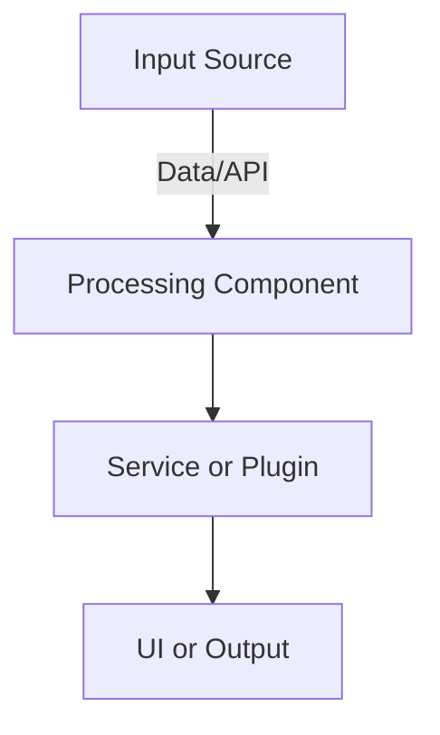
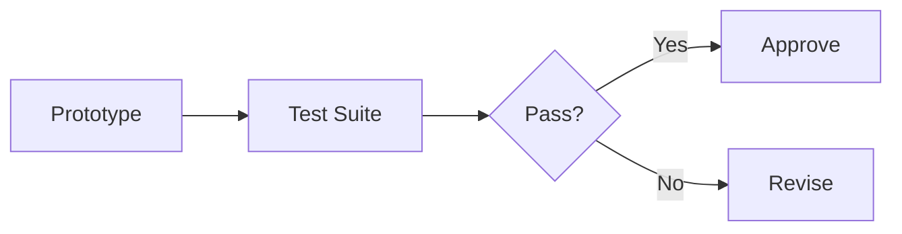

# [Section]-O# — [Short Title]

*(Status: Proposed | Favored | In Review | Approved | Deprecated)*

**Option ID:** [Section]-O#
**Section ID:** [Section] — [Section Title]
**Version:** 0.1.0
**Authors:** Jon Fortney
**Reviewers:** [Working Group or Reviewers]
**Created:** YYYY-MM-DD
**Last Updated:** YYYY-MM-DD
**Related SRS:** `Sections/[Section_Folder]/[Section_Title].md`
**Related ADRs:** `[Section]-ADR-###_Title.md` (planned or linked)

---

## 1) Summary

Briefly describe this option’s intent, scope, and distinguishing concept.
Keep it short and outcome-focused.

> **Example:** *Provides a unified architecture for cross-platform runtime while maintaining modular plugin compatibility.*

---

## 2) Problem, Goals, and Non-Goals

**Problem:**
Summarize the issue or need that this option addresses.

**Goals:**

* Satisfies **R-[Section]000**, **R-[Section]001**, **R-[Section]00N**
* Addresses **C1**, **C2**, etc. from SRS [Section.9]

**Non-Goals:**
Explicitly state what this option does *not* cover or prioritize.

---

## 3) Architecture Overview

Describe how this option integrates within the system’s architecture.

* **Core concept:** concise summary of the approach.
* **Primary components / boundaries:** outline interfaces or data paths.
* **Process / data flow summary:** show runtime or control relationships.
* **Integration context:** plugin, service, or subsystem.

---

## 4) Interfaces & Contracts

* **Public contracts:** key APIs, schemas, or events.
* **Compatibility policy:** versioning, deprecation, or contract rules.
* **Discovery / registration mechanism:** e.g., manifest, reflection, or registry.

> **Trace:** link to requirement IDs defining these contracts.

---

## 5) Dependencies & Constraints

* **Runtime / libraries:** toolchains, frameworks, or dependencies.
* **OS / hardware:** architectures, devices, or environments.
* **Constraints:** safety, licensing, or compliance limitations.

---

## 6) Security, Privacy, and Compliance

* **Threats & mitigations:** describe known risks and responses.
* **Secrets management:** handling, storage, and rotation policies.
* **Data handling:** encryption, retention, and compliance factors.

---

## 7) Performance & Sizing Targets

* **Latency / throughput:** define measurable objectives.
* **Resource budgets:** CPU, memory, or network limits.
* **Scalability model:** how it scales across workloads.

---

## 8) Operability

* **Logging:** format, levels, rotation.
* **Metrics / health:** endpoints, KPIs, monitoring.
* **Configuration:** environment hierarchy, reload rules.
* **Diagnostics:** error capture, crash reporting, trace export.

---

## 9) Packaging & Distribution

* Describe packaging (installer, container, bundle).
* CI/CD flow or artifact outputs.
* Supported runtime modes or environments.

---

## 10) Migration, Rollout, and Backout

* **Migration path:** transition plan from existing approach.
* **Rollout plan:** staged or conditional release.
* **Backout plan:** rollback procedures and triggers.

---

## 11) Risks & Failure Modes

| ID | Risk / Failure Mode | Likelihood | Impact | Mitigation / Trigger |
| -- | ------------------- | ---------- | ------ | -------------------- |
| R1 | [Example risk]      | Medium     | High   | [Mitigation plan]    |
| R2 | [Example risk]      | Low        | Medium | [Mitigation plan]    |

---

## 12) Alternatives Considered

| Option       | Summary             | Reason Not Selected |
| ------------ | ------------------- | ------------------- |
| [Section]-O? | [Short description] | [Key trade-off]     |
| [Section]-O? | [Short description] | [Key trade-off]     |

---

## 13) Validation Plan

**Success criteria:** link to measurable requirements.
**Validation steps:**

1. Define prototype or proof-of-concept scope.
2. Outline testing and benchmarking methods.
3. Include acceptance thresholds and metrics.

---

## 14) Effort and Complexity

| Area           | Effort                | Notes |
| -------------- | --------------------- | ----- |
| Interfaces     | [Low / Medium / High] |       |
| Implementation | [Low / Medium / High] |       |
| Testing        | [Low / Medium / High] |       |
| Packaging      | [Low / Medium / High] |       |

---

## 15) Community and Ecosystem Impact

* Developer and contributor implications.
* Compatibility with existing tools or workflows.
* Third-party or vendor integration effects.

---

## 16) References

* **SRS:** `[Section]_Title.md`
* **ADRs:** `[Section]-ADR-###_Title.md`
* **Prior work:** link related issues, prototypes, or notes.

---

## Appendix: Change Log

| Version | Date | Changes | Owner/Author | PR / Issue |
|---------|------|---------|--------------|------------|
| 0.1.0 | 2025-11-09 | Added governance metadata/access policy and appended this changelog. | Jon Fortney |  |
| 0.1.0 | YYYY-MM-DD | Initial draft | Nexus Team (Codex) |  |
| 0.1.0 | YYYY-MM-DD | Review updates | Nexus Team (Codex) |  |
| 0.1.0 | YYYY-MM-DD | Approved | Nexus Team (Codex) |  |

---

## 18) Review Checklist

* [ ] Requirements traced and complete.
* [ ] Interfaces and contracts defined.
* [ ] Security and performance covered.
* [ ] Validation plan with metrics.
* [ ] Risks and mitigations documented.
* [ ] References linked.

---

> **Lifecycle:** Proposed → Favored → In Review → Approved → Deprecated
> **Cross-link:** Supports Decision Matrix § [Section.12] in parent SRS.
