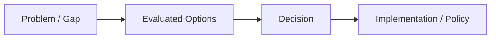
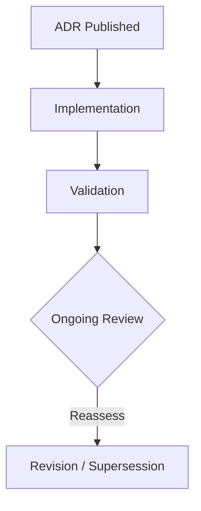

# [Section]-ADR-### — [Decision Title]

*(Status: Proposed | Accepted | Superseded | Deprecated | Rejected)*

**Authors:** Jon Fortney
**Reviewers:** [Working Group or Circle]
**Created:** YYYY-MM-DD
**Last Updated:** YYYY-MM-DD
**Supersedes:** (optional)
**Superseded by:** (optional)
**Related SRS:** `[Section]_Title.md`
**Related Options:** `[Section]-O#-[ShortTitle].md`

---

## 1) Context

Describe the background, motivation, and problem this ADR resolves. Summarize the competing approaches and key constraints that informed the decision.

> **Example:** *The system requires a unified framework for cross-platform builds without duplicating runtime dependencies.*

Include links or citations to relevant sections of the SRS, issue discussions, benchmarks, or community threads that provided input.

---

## 2) Decision

State the final, explicit decision and its scope.

> **Example:** *Standardize the system on [Framework/Language/Architecture] for all core modules and plugins.*

### Decision Summary

* **Scope:** Which modules or layers are affected.
* **Boundary:** What remains out-of-scope.
* **Implementation Level:** Policy / Design / Code / Process.

---

## 3) Consequences

**Positive Impacts:**

* [Benefit 1]
* [Benefit 2]

**Negative / Mitigated Impacts:**

* [Trade-off 1] — mitigation strategy.
* [Trade-off 2] — mitigation strategy.

**Follow-up Actions:**

* [Action 1] — task or milestone link.
* [Action 2] — who/when/how.

---

## 4) Rationale

Explain *why* this option was chosen over alternatives. Summarize the key trade-offs and reasoning from the SRS Decision Matrix (§ [Section.12]).

> **Example:** *This approach offered best maintainability and cross-platform coverage with minimal engineering cost.*

---

## 5) Alternatives Considered

| Option       | Summary             | Reason Not Selected    |
| ------------ | ------------------- | ---------------------- |
| [Section]-O# | [Short description] | [Key drawback or risk] |
| [Section]-O# | [Short description] | [Key drawback or risk] |

---

## 6) Implementation & Governance

Describe any operational or procedural policies needed to sustain this decision.

* **Governance ownership:** Who maintains this decision and revisits it.
* **Update cadence:** How often it’s reviewed or revalidated.
* **Documentation:** What must be kept in sync (e.g., manifests, APIs, contracts).

> **Optional diagram:** decision flow or governance policy.

---

## 7) Risks & Mitigations

| ID | Risk           | Impact | Mitigation / Monitoring |
| -- | -------------- | ------ | ----------------------- |
| R1 | [Example risk] | Medium | [Mitigation strategy]   |
| R2 | [Example risk] | High   | [Mitigation strategy]   |

---

## 8) Legacy Implementation Notes

Summarize how earlier versions or legacy systems approached this decision area.

* [Legacy project or branch]: [Key characteristics]
* [Shortcomings / rationale for change]

---

## 9) Governance Updates

Define any maintenance or policy frameworks resulting from this decision.

* **Review frequency:** [e.g., annually or per release cycle]
* **Decision owner:** [Working group or maintainer]
* **Compliance metrics:** how conformance will be checked.

---

## 10) References

* **SRS Sections:** `[Section]_Title.md` — [X.5], [X.12]
* **Option Documents:** `[Section]-O#-[ShortTitle].md`
* **Prior ADRs:** `[Section]-ADR-###_Title.md` (if applicable)
* **External References:** specs, RFCs, community posts, or repositories.

---

## Appendix: Change Log

| Version | Date | Changes | Owner/Author | PR / Issue |
|---------|------|---------|--------------|------------|
| 0.1.0 | 2025-11-09 | Added governance metadata/change-log template and this appendix. | Jon Fortney |  |
| 0.1.0 | YYYY-MM-DD | Initial draft | Nexus Team (Codex) |  |

---

> **Lifecycle:** Proposed → Accepted → Superseded → Deprecated → Rejected
> **Traceability:** Links to SRS Decision Matrix (§ [Section.12]) and corresponding Option files.
