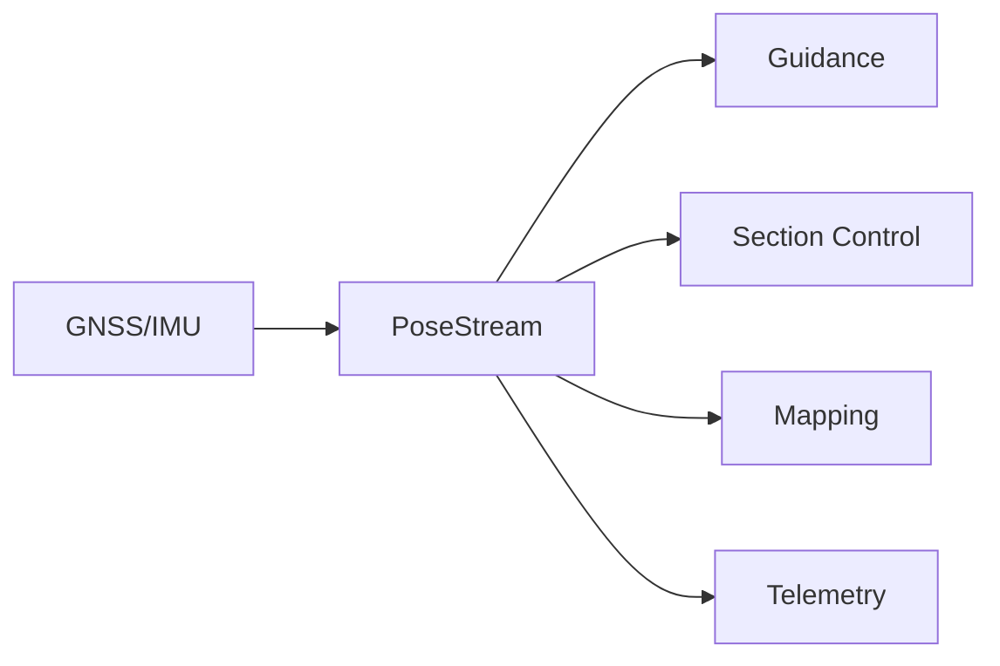
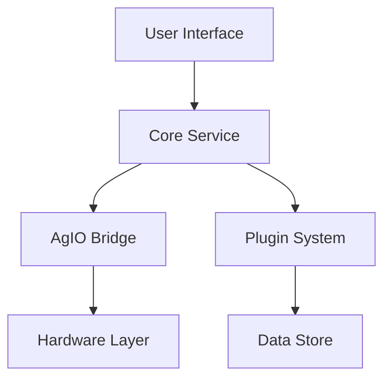

# Data Flow Architecture

This document describes how data flows through the Nexus system, as specified in [SRS Communications Requirements](../../sections/4X_Interprocess_Communications/44_Service_APIs.md) and implemented through [ADR-002: gRPC Contracts](../../sections/4X_Interprocess_Communications/41-ADR-002 - Expose Nexus services over gRPC protobuf contracts.md).

## Core Data Streams

### PoseStream
As defined in [ADR-007: PoseStream Architecture](../../sections/6X_Core_Domain_Services/61-ADR-007 - PoseStream and SectionState architecture.md):

### Control Flow

## Key Data Types

1. **Real-Time Control Data**
   - PoseStream frames (20Hz)
   - Section states
   - Steering commands
   - Rate control values

2. **Mapping & Analytics**
   - Field boundaries
   - Coverage maps
   - As-applied data
   - Yield data

3. **Configuration & State**
   - Vehicle settings
   - Tool configurations
   - User preferences
   - Session state

## Data Storage

### Vector Tile Store
As specified in [ADR-009: Vector Tile Storage](../../sections/3X_Data_Storage/32-ADR-009 - PoseStream vector logs and layer TileStore persistence.md):
- Efficient spatial indexing
- Compressed storage format
- Real-time update capability

### Session Data
Following [ADR-023: Session/Job Model](../../sections/6X_Core_Domain_Services/62-ADR-023 - Session and job model with provenance graph.md):
- Job records
- Equipment configurations
- Operation logs
- Analytics data

## Protocol Stack

| Layer | Protocol | Documentation |
|-------|----------|---------------|
| UI-Core | gRPC | [Service API contracts](../../sections/4X_Interprocess_Communications/44_Service_APIs.md) |
| Core-Plugin | gRPC | [Plugin architecture](../../../../Plugins/architecture.md) |
| Core-Bridge | gRPC | [AgIO subsystem overview](../../../../AgIO/README.md) |
| Bridge-Hardware | AOG-Link | [External module message & PGN guide](../../../../AgIO/external-module-pgns.md) |

## Data Integrity

### Validation
- Schema validation
- Constraint checking
- Type safety
- Range limits

### Persistence
- Atomic writes
- Transaction support
- Conflict resolution
- Backup strategy

## Performance Characteristics

As defined in [ADR-026: Performance Budgets](../../sections/9X_Frontends_Ops/96-ADR-026 - Performance budgets and instrumentation.md):

| Metric | Target | Notes |
|--------|--------|-------|
| PoseStream Latency | <50ms | End-to-end |
| Storage Write | <100ms | 95th percentile |
| Query Response | <200ms | Complex spatial |
| Memory Usage | <2GB | Full system |

## Related Documentation

- [Communications Requirements](../../sections/4X_Interprocess_Communications/44_Service_APIs.md)
- [Data Model Requirements](../../sections/3X_Data_Storage/32_Persistence_Formats.md)
- [Threading, Scheduling & Timing requirements](../../sections/2X_System_Architecture/24_Threading_Scheduling_Timing.md)
- [AgIO subsystem overview](../../../../AgIO/README.md)
- [External module message & PGN guide](../../../../AgIO/external-module-pgns.md)
