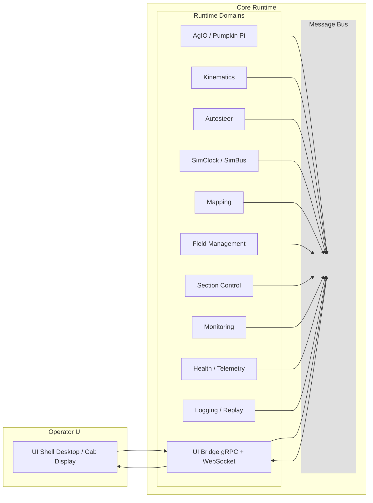

# 21 — System Decomposition & Boundaries
*(Status: Drafting)*

**Section ID:** 21 | **Version:** 0.1.0  
**Related Sections:** 11 — Operating System Support, 12 — Development Language & Runtime, 13 — UI Framework & UX  
**Related Decisions:** `11-ADR-001 — Establish Windows & Linux Support Baseline`, `12-ADR-001 — Adopt .NET 10 Runtime`, `13-ADR-001 — Adopt Avalonia 12 for the AgOpenNext Desktop UI Shell`  
**Upstream Dependencies:** 1X — Platform Foundations, 4X — Interprocess Communications  
**Downstream Impacts:** 3X — Data Storage, 5X — Hardware I/O Device Layer

## 21.1 Purpose & Scope

This section defines how **AgOpenNext** is decomposed into its primary **logical domains**—such as guidance, mapping, I/O, automation, and simulation—and outlines the **candidate deployment boundaries** between core services, AgIO, UI hosts, and SDK-driven plugins.

Its purpose is to provide a **decision-agnostic framework** for understanding and discussing system structure. Specific architectural selections (e.g., where boundaries are enforced, which layers are modularized, and how components communicate) will be documented in §21.14 _Options_ and corresponding ADRs.

This section establishes:
- A shared vocabulary for describing AgOpenNext subsystems and their relationships.  
- The **architectural forces and constraints** that drive decomposition decisions.  
- The **evaluation criteria** to be applied when comparing alternative system shapes.

---

## 21.2 Legacy Baseline (Context Only)

Historically, **AgOpenGPS (V6 / RC)** centered the bulk of its logic inside the main WinForms host, yet it already relied on
companion executables:

- `ApplicationCore` (WinForms) coordinated guidance, steering, and mapping in the primary thread space.
- **AgIO** shipped as a separate Windows process that bridged CAN/serial hardware via shared memory and PGNs.
- **Rate & Section Control (RC)** could be deployed as an additional process when operators enabled advanced rate logic.
- Simulation and telemetry replay depended on bespoke stubs with minimal API seams between the processes.
- Timing, UI rendering, and logic loops remained tightly interleaved, so crashes or stalls in one area frequently impacted the
  rest of the stack despite the process split.

This loose multi-process arrangement offered limited fault isolation while still resisting cross-platform delivery and
community-driven extensions.

---

## 21.3 Core Functional Domains

This section defines the major runtime functions AgOpenNext must provide.  
These domains describe **what the system does**, not **how it is packaged**.

Each domain may be:
- **Integrated** directly into Core,
- **Loaded dynamically** as a module or plugin, or
- **Isolated** as a separate service or bridge.

Packaging choices are outside the scope of this section and will be resolved in option analyses and ADRs.  
The purpose here is to identify the capabilities AgOpenNext must deliver in-field and define clear, separable concerns.

These domains form the logical architecture baseline referenced by later decomposition and interface diagrams (§21.5–§21.9).

---

### 21.3.1 Kinematics / Pose Handling
- Fuse GNSS, IMU, wheel angle, wheel speed, and slip inputs.  
- Maintain the authoritative machine pose (position, heading, attitude) and synchronized timebase.  
- Produce timestamped state updates consumed by other domains.  
- Hard real-time domain — everything else depends on it.

### 21.3.2 Guidance
- Generate steering intent based on AB lines, headlands, waylines, or curved paths.  
- Compute look-ahead targets and convergence logic.  
- Respect field boundaries and prior coverage.  
- React quickly enough not to lag behind pose updates.

### 21.3.3 Autosteer
- Convert guidance intent and current pose into actuator commands.  
- Enforce engagement logic, watchdogs, and safety interlocks.  
- Manage steering arbitration when multiple control sources exist.  
- Latency-sensitive; this is a safety-critical loop.

### 21.3.4 Field Management
- Represent fields, boundaries, headlands, guidance lines, and applied coverage areas.  
- Track operational context: *where am I, what field/job is active, what implement configuration applies.*  
- Provide field context to Guidance, Mapping, and Section Control.  
- Persist reliably across sessions and machines.

### 21.3.5 Mapping
- Maintain live coverage maps, application layers, and pass geometry.  
- Supply spatial data for both operator visualization and automated logic.  
- Coordinate with Field Management to ensure data integrity and projection consistency.  
- Not hard real-time, but must be coherent and thread-safe.

### 21.3.6 Section Control
- Control individual boom sections, row units, or clutches.  
- Apply coverage-based shutoff and automatic re-enable logic.  
- Enforce field boundaries and “no-apply” zones.  
- Safety-relevant domain: commands directly affect physical outputs.

### 21.3.7 Monitoring
- Aggregate sensor data from yield, planter, and flow/blockage systems.  
- Normalize readings for live feedback, alarms, and post-run analysis.  
- Operate continuously even when the UI is remote or disconnected.  
- Feed Mapping, Logging, and System Health domains.

### 21.3.8 System Health & Telemetry
- Track device status, system health, and fault states.  
- Maintain heartbeats and watchdogs for safety-critical loops.  
- Expose human- and machine-readable status to UIs or remote diagnostics.  
- Support remote assistance and dealer-level telemetry.

### 21.3.9 Data Logging / Replay
- Record runtime data streams (pose, commands, coverage, and operator actions).  
- Persist logs for replay, analysis, compliance, and regression validation.  
- Allow other domains to be driven from replay data in place of live hardware.  
- Foundation for QA, training, and “what actually happened” diagnostics.

### 21.3.10 Simulation
- Provide simulated sensors and actuators identical in interface to live hardware.  
- Run the system from a deterministic simulation clock rather than wall time.  
- Enable testing of Guidance, Autosteer, and Mapping without physical equipment.  
- Essential for QA, CI, and reproducible troubleshooting.

### 21.3.11 UI Bridge
- Expose Core state (pose, coverage, health, etc.) to operator interfaces.  
- Accept operator actions and reinject them into Core as structured commands.  
- Define a versioned, remote-safe API (e.g., gRPC or WebSocket).  
- UIs must communicate exclusively through the Bridge — never directly with hardware or internal Core memory.  
- Serves as the sole communication surface between §6X Core Domains and §9X Frontends & Operator Interfaces.

### 21.3.12 AgIO / Hardware I/O
- Communicate with the physical world via serial, CAN, UDP, or similar buses.  
- Acquire sensor data (GNSS, steering angle, flow sensors, etc.).  
- Drive actuators (valves, clutches, rate controllers).  
- Normalize vendor-specific formats into shared internal messages.  
- Maintain parity between legacy and next-generation link layers.  
- Implements I/O for all domains requiring hardware contact; not a separate domain in itself.

#### AgIO AOG-Link V1
- Modernized, timing-reliable hardware link layer for production use.  
- Supports UDP/serial/CAN interfaces with deterministic update rates.

#### AgIO AOG-Link V0
- Legacy compatibility model reflecting historical AgIO behavior.  
- Preserved to ensure continuity for existing farm systems.  
- Maps identically onto the same internal message surfaces as V1.

#### Pumpkin Pi
- Provides a **hardware abstraction layer (HAL)** for Raspberry Pi / CM5-based deployments.  
- Exposes GPIO, I²C, SPI, and CAN interfaces through a unified internal API.  
- Bridges Core message surfaces to physical drivers with deterministic scheduling for steering and section loops.  
- Serves as the **reference hardware I/O stack** for embedded AgOpenNext builds, keeping Core and AgIO logic OS-neutral.

---

### 21.3.13 Potential Future / Community Extensions *(Informative Only)*

The following domains are **not** required for Core but are documented as likely community or partner extensions once SDK contracts mature.

#### 21.3.13.1 Advanced Agronomic Controls
- **Variable Rate Control** — continuous application-rate adjustment from prescription maps or operator input, integrated with Section Control and Mapping.  
- **Tree Planting Automation** — position-based seedling or sapling placement with map-driven spacing.  
- **Variable Tiling Depth** — automated tile-plow depth based on elevation or soil models.  
- **Variable Grade / Landforming** — implement elevation control for drainage and contour leveling.  
- **Multi-Crop Prescriptions** — simultaneous multi-product or multi-zone rate management.  
- **Crop / Genetic Tracking** — multi-variety identification and zone-specific performance analytics.

#### 21.3.13.2 Enhanced Monitoring Domains
- **Expanded Planter Monitoring** — per-row singulation, downforce, and spacing analytics.  
- **Yield Analysis Extensions** — live moisture correction, cart calibration, and multi-field aggregation.  
- **Machine Health Extensions** — predictive maintenance using vibration, temperature, and fluid-level telemetry.  
- **Machine Gauges** — richer dashboard-style UI elements with customizable gauge types.

#### 21.3.13.3 External Integrations
- **Farm Management Links** — synchronization APIs with record-keeping systems (Ag Leader SMS, FieldView, etc.).  
- **Telematics Gateways** — fleet-level connectivity and OEM diagnostics.  
- **Community Mapping Layers** — cooperative overlays for soil type, drainage, and boundaries.

These extensions are out of scope for Core verification but serve as forward references for community innovation.

---

## 21.4 Data & Interface Contracts

This section defines how AgOpenNext components must exchange information in a consistent and verifiable manner, regardless of future architectural or packaging decisions.  
The goal is to ensure that all runtime data—whether internal or external—remains **typed, versioned, and deterministic**, independent of how it is transported or implemented.

---

### 21.4.1 Purpose & Scope
Every functional domain (§21.3) must be able to share state and commands with others in a predictable way.  
This requires common **data contracts** that describe message structure, timing, and validation rules.  
These contracts may later be realized through in-process calls, serialized data streams, or inter-service communication, but their **logical shape and consistency rules** are defined here.

---

### 21.4.2 Contract Principles
- **Typed and Explicit:** All shared data must be defined by an explicit schema or type system.  
- **Versioned and Traceable:** Each contract version must be identifiable, allowing controlled evolution.  
- **Deterministic:** Data exchange must not alter sequence, timing, or precision of control-loop behavior.  
- **Transport-Neutral:** Requirements apply equally to any eventual transport or API layer.  
- **Discoverable:** Components must be able to enumerate which contracts are available at runtime.  
- **Safe for Isolation:** No component may rely on shared memory or implicit state outside its contract.

---

### 21.4.3 Contract Categories

| Contract Group | Description | Example Producers / Consumers |
|----------------|-------------|-------------------------------|
| **Pose & Telemetry** | Position, attitude, and motion state. | Kinematics ↔ Guidance |
| **Spatial Layers** | Map geometry, coverage, and boundaries. | Mapping ↔ Field Management |
| **Guidance & Tasks** | Guidance intents, paths, and job metadata. | Guidance ↔ Autosteer |
| **Setpoints & Commands** | Requested actuator or rate values. | Control ↔ I/O Systems |
| **Health & Diagnostics** | Status, heartbeat, and safety signals. | System Health ↔ Operator Interfaces |

These represent the minimal shared data surfaces required for runtime interoperability.

---

### 21.4.4 Compatibility & Validation
To maintain deterministic operation:
- Contract changes must be additive or explicitly versioned.  
- Components must tolerate missing or unknown fields.  
- Validation rules must define acceptable timing, range, and precision.  
- Consistency checks must detect schema or unit mismatches at load time.

---

### 21.4.5 Verification Requirements
- **Schema Tests:** Verify structural compatibility across versions.  
- **Timing Tests:** Ensure data cadence and latency meet real-time thresholds.  
- **Replay Tests:** Recorded data must reproduce identical state transitions.  
- **Discovery Tests:** Verify that components expose and consume the expected contract sets.

---

### 21.4.6 Summary
This section establishes the requirement that AgOpenNext data exchange be **schema-defined, versioned, deterministic, and transport-neutral**.  
Whether realized through shared libraries, inter-process APIs, or modular boundaries will be determined by later option analyses and ADRs.  
The principle is that every participant in the system—core logic, external tool, or future extension—must speak the same verifiable language of data.

---

## 21.5 Illustrative Stack Patterns

**Description (Informative Example)**  
This diagram illustrates one possible realization of a *modular Core runtime* architecture.  
It is not prescriptive, but shows how runtime domains **could** exchange data through a common internal surface while exposing a consistent interface to external UIs.

- All domains operate within a single runtime environment.  
- Each domain publishes and consumes **structured, timestamped state** through a common data exchange surface (shown here as a “Message Bus”).  
- The data surface provides isolation — domains do not reach directly into each other’s state.  
- A bridge component projects selected data to the UI and accepts operator input in a structured form.  
- External interfaces remain abstract; the same logical model could be implemented via shared memory, IPC, or service APIs.  

**Why this matters (Rationale)**  
- Provides a clear mental model for modular separation without assuming a specific transport or process layout.  
- Encourages deterministic, auditable data flow and simplifies replay or simulation.  
- Supports portable builds — desktop, cab display, or embedded — without changing functional contracts.  
- Establishes a baseline for later option analyses (§21.14) that compare concrete implementation shapes.

---

## 21.6 Partition Decision Drivers

When evaluating whether a capability belongs in Core or crosses a process/service boundary, consider the following requirement-derived forces:

- **Timing** — loops tighter than ~10 ms demand deterministic scheduling; confirm whether IPC budgets satisfy the requirement envelope before externalizing.
- **Fault Isolation** — safety-critical I/O may need restart isolation or watchdog boundaries; capture the required failure handling semantics in requirements.
- **Release Cadence** — some domains must iterate independently of Core releases; option analyses should document how updates are delivered.
- **Operational Boundaries** — OS-specific dependencies can force separation for packaging reasons; capture constraints for each supported platform.
- **Simulation Parity** — services requiring SimClock/SimBus must preserve determinism across deployment topologies; options should explain how parity is maintained.
- **Team Ownership** — working group boundaries can influence module separation; traceability must link ownership to verification obligations.

---

## 21.7 Domain Interaction & Dependency Considerations

This section captures the **runtime sensitivities and data dependencies** of each major domain.  
It replaces earlier Core vs. external hosting discussions, as all domains now operate within a unified runtime governed by structured data contracts rather than cross-process IPC.

The focus is therefore on **determinism, sequencing, and data flow** between domains, not on packaging or transport.

| Domain | Primary Dependencies | Determinism / Timing Requirements | Notes & Integration Constraints |
|--------|----------------------|-----------------------------------|--------------------------------|
| **Kinematics / Pose Handling** | Sensor inputs (GNSS, IMU, wheel sensors), system clock | Hard real-time; defines authoritative pose and timebase for all others | Must complete updates before Guidance or Autosteer consume data; no buffering beyond one frame. |
| **Autosteer** | Kinematics (pose/heading), Guidance (target path) | Hard real-time; deterministic control loop | Must run on deterministic schedule tied to Kinematics updates; safety interlocks verified each loop. |
| **Guidance** | Kinematics (pose/time), Field Management (boundaries, AB lines) | Soft real-time (< 100 ms typical) | Produces convergence targets and path data consumed by Autosteer; decoupled via typed struct updates. |
| **Field Management** | Mapping (coverage), operator configuration | Non-real-time | Provides spatial and contextual metadata to Mapping, Guidance, and Section Control; persistent store required. |
| **Mapping** | Kinematics (position), Section Control (coverage events) | Near-real-time; thread-safe | Maintains live spatial layers and coverage history; must serialize deterministically for replay. |
| **Section Control / Rate Control** | Mapping (coverage), Field Management (boundaries) | Fast loop (~50 ms) | Issues setpoints for actuators; requires atomic updates for deterministic replay. |
| **Monitoring** | Sensors, AgIO telemetry | Continuous but non-deterministic | Aggregates sensor data and feeds Health domain; runs safely outside hard loops. |
| **System Health / Telemetry** | Monitoring, Core status hooks | Event-driven | Reports heartbeats and diagnostics to UI Bridge; never blocks control paths. |
| **Logging / Replay** | All domains (state snapshots, command streams) | Deterministic ordering; not time-critical | Must capture messages in the same sequence as produced for bit-exact replay. |
| **Simulation** | All domains (substitute providers) | Deterministic SimClock pacing | Mirrors live interfaces using same contracts; guarantees time-coherent replay for testing. |
| **AgIO / Hardware I/O** | Section Control, Autosteer, Monitoring | Hard real-time at I/O layer | Must adhere to actuator timing envelopes; struct contracts ensure deterministic command delivery. |
| **UI Bridge** | All domains via struct interfaces | Human-rate (< 1 Hz–5 Hz typical) | Projects selected Core data to operator UI; may downsample or cache, but must not affect control timing. |

---

### Summary

- All domains now operate within one deterministic runtime governed by a shared struct-based data model.  
- Domain boundaries exist for **functional separation**, not for process isolation.  
- Determinism, sequencing, and contract compliance are the key verification concerns.  
- Any future decision to externalize a domain must demonstrate identical timing and replay behavior through the same contract surfaces.

---

## 21.8 Deployment & Platform Considerations

AgOpenNext must execute consistently across supported operating environments without changing functional behavior.  
The deployment model (desktop, embedded, or containerized) affects packaging, not runtime logic.

- **Platform Parity:** Core, AgIO, and UI components must produce identical results across Linux, Windows, and embedded CM-class boards.  
- **Hardware Access:** Platform-specific drivers (CAN, serial, GPIO) are abstracted through the same struct interfaces used by software simulation.  
- **UI Shells:** Operator interfaces may be co-located or remote, but always interact through versioned data contracts (§21.4).  
- **Configuration & Persistence:** Platform packaging must not alter schema or timing expectations; persistence mechanisms are interchangeable as long as data fidelity is maintained.

---

## 21.9 Simulation & Replay Requirements

Simulation and replay are mandatory capabilities of the runtime.  
They use the same data contracts and scheduling rules as live operation to ensure deterministic equivalence.

1. **Deterministic Timebase:** A single SimClock governs simulated and live loops; replay must reproduce identical event sequences.  
2. **Provider Substitution:** Any domain may swap live I/O with simulated providers if contract compliance and timing parity are maintained.  
3. **Data Integrity:** Recorded state and command streams must round-trip losslessly through the replay mechanism.  
4. **Verification:** Replay outputs must match live runs within defined tolerances (pose ±1 cm, coverage ±1 %).  

Simulation must be available in all build configurations for validation and testing.

---

## 21.10 Comparative Architecture Models (Informative)

This section documents high-level runtime shapes considered during option analysis.  
These are descriptive, not prescriptive. The purpose is to give common language for ADRs and implementation planning.

| Model | Description | Notes |
|--------|-------------|-------|
| **A — Monolithic Core** | All logic compiled into one executable with no internal modular boundaries. | Historical model. Tight coupling, low extensibility. |
| **B — Modular Monolith** | All logic runs in one process, but domains are separated into structured modules / namespaces with defined interfaces. | Improves clarity and testability but modules are still statically compiled. |
| **C — Multi-Process Runtime** | Core, AgIO, and selected domains run as separate processes/services and communicate across an IPC or RPC boundary. | Considered for isolation and serviceability; introduces orchestration and latency concerns. Retained for comparison only. |
| **D — Core-Hosted Dynamic Modules (Reference Model)** | A single Core runtime hosts multiple loadable domain modules. Modules communicate only through versioned, structured data contracts (§21.4). Direct memory sharing across domains is prohibited. A bridge component may expose selected data to operator UIs. | This is the current reference direction. It preserves deterministic, in-process timing while still allowing domains to be independently developed, loaded, and replaced under contract governance. |

### 21.10.1 Domain Placement in the Reference Model

Under Model D (Core-Hosted Dynamic Modules), all runtime domains from §21.3 are expected to run under one deterministic scheduler, but not all domains are equal in their timing sensitivity.

| Domain | Runs Inside Core Runtime | Timing Sensitivity | Notes |
|--------|-------------------------|--------------------|-------|
| Kinematics / Pose Handling | Yes | Hard real-time | Defines the authoritative pose and timebase. Must run first in the loop. |
| Autosteer | Yes | Hard real-time | Consumes pose and guidance, drives actuators. Safety-critical. |
| Guidance | Yes | Soft real-time | Generates path/intent used by Autosteer. Can update less frequently than steering. |
| Field Management | Yes | Non-real-time | Provides contextual info (field, boundary, headland, implement config). |
| Mapping | Yes | Near-real-time | Maintains coverage layers and spatial history; must serialize deterministically for replay. |
| Section Control / Rate Control | Yes | Fast loop | Issues on/off and rate setpoints using Mapping + Field Management context. |
| Monitoring | Yes | Continuous | Aggregates sensor/implement feedback for operator visibility and alarms. |
| System Health & Telemetry | Yes | Event-driven | Publishes fault/heartbeat/state to operator surfaces. Must never block control loops. |
| Logging / Replay | Yes | Deterministic ordering | Records all contract surfaces in sequence for later replay. |
| Simulation | Yes | Deterministic under SimClock | Can replace live providers with simulated ones using the same contracts. |
| AgIO / Hardware I/O | Yes | Hard real-time at edge | Talks to valves, steering, switches, sensors. Must meet actuator timing windows. |
| UI Bridge | Yes | Human-rate | Projects selected runtime state to operator UI and converts operator actions into structured commands. Runs at human interaction rates, not control-loop rates. |

### 21.10.2 Evaluation Matrix

This matrix compares the four models at a high level. Model D is considered the reference model for future ADR work.

| Criterion | Model A — Monolithic | Model B — Modular Monolith | Model C — Multi-Process Runtime | Model D — Core-Hosted Dynamic Modules (Reference) |
|-----------|----------------------|----------------------------|--------------------------------|---------------------------------------------------|
| **Performance** | Highest raw performance, but tightly coupled | High | Dependent on IPC/transport latency | High; single process with predictable scheduling |
| **Determinism** | High if loop is simple | High if scheduling is centralized | Requires synchronized timing between processes | High; one scheduler and one timebase across all domains |
| **Reliability / Fault Behavior** | Single fault domain; crash = full stop | Same as A | Process isolation possible | Single fault domain, but modules can be restarted/unloaded or health-gated at runtime |
| **Maintainability** | Low | Medium | High (independent services) | High (modules evolve independently behind contracts) |
| **Cross-OS Portability** | Low | Medium | High if each service ports cleanly | High if the Core runtime and contracts are portable |
| **Extensibility / Community Contribution** | Low | Medium | High via external services | High via loadable modules that respect contract/version rules |
| **Testing & Replay** | Ad hoc | Partial harness support | Good if every service journals data | First-class: deterministic replay uses the same contracts modules use at runtime |
| **Deployment Complexity** | Simplest | Simple | Higher (orchestration/supervision required) | Moderate: one runtime, but with module/version management |

---

#### Why model D is being treated as the reference

- It preserves deterministic timing by keeping all control loops in one runtime.  
- It still gives you modularity: modules can be developed, signed, versioned, even swapped — without forking Core.  
- The “contract surfaces” in §21.4 become the enforcement tool: if a module doesn’t honor the contract, it can’t load.  
- It gives the community a way to contribute new capability (say, a better Guidance module or an agronomic controller) without rewriting the whole tractor brain.

---

## 21.11 Determinism & Latency Constraints

All runtime behavior must remain **deterministic**, regardless of hardware or platform:

- **Single Time Source:** All loops derive timing from one authoritative SimClock.  
- **Data Sequencing:** Every update includes timestamps and sequence numbers.  
- **Deadline Adherence:** Hard-real-time domains (Kinematics, Autosteer, I/O) must meet loop deadlines under all load conditions.  
- **Thread Safety:** Shared data must use lock-free or bounded-wait mechanisms to prevent jitter.  
- **Replay Fidelity:** Recorded and replayed runs must produce identical internal event order.  

Latency budgets are internal engineering constraints, not SRS requirements, but all implementations must verify that control and replay remain deterministic.

---

## 21.12 Verification Objectives

System verification focuses on proving **functional equivalence, determinism, and platform parity**:

| Objective | Acceptance Criteria |
|------------|--------------------|
| **Deterministic Replay** | Simulation jitter ≤ 2 ms p95, identical sequence order. |
| **Cross-Platform Parity** | Numerical variance < 1 % for identical inputs across OS targets. |
| **Startup Health** | All domains report ready within 30 s of initialization. |
| **Contract Integrity** | Schema validation passes on load; unknown fields ignored safely. |
| **Fault Containment** | Domain failure does not propagate invalid state to others. |

Verification artifacts link to test cases and automated regression logs in CI pipelines.

---

## 21.13 Open Questions

| ID | Question | Current Direction | Owner |
|----|-----------|------------------|--------|
| Q-21-1 | How should AgIO drivers register structured data sources for different platforms? | Through contract-based discovery rather than process boundaries. | Core / I/O WG |
| Q-21-2 | What minimum SDK contract set supports domain and UI parity? | Pose, Layer, Target, Setpoint, Health as baseline. | SDK WG |
| Q-21-3 | How to guarantee deterministic replay across multi-threaded loops? | Use SimClock sequencing and ordered message journaling. | Simulation WG |
| Q-21-4 | What level of dynamic loading (if any) will SDK support? | TBD in §52 option analysis. | SDK WG |

---

## 21.14 Option References

Option subsections (§21-O1 … 21-O7) define detailed architectural alternatives evaluated for AgOpenNext.  
Each option will document:
- Assumed domain structure and deployment model,  
- Quantitative metrics (determinism, maintainability, complexity), and  
- Associated ADR references for traceability.

---

## 21.15 Traceability & Compliance

All functional and architectural requirements defined in §21 are traceable to verification evidence.  
Traceability matrices link:

- **Requirements → Domain Functions** (§21.3)  
- **Contracts → SDK Schemas** (§21.4)  
- **Timing / Determinism → Simulation Tests** (§21.9, §21.12)  
- **Deployment Consistency → Platform Builds** (§21.8)  

Compliance is achieved when all tests confirm deterministic equivalence across supported platforms and build modes.

---

## Appendix: Change Log

| Version | Date | Changes | Author | PR / Issue |
|---------|------|---------|--------|------------|
| 0.1.0 | 2025-11-09 | Added governance metadata/change-log appendix and noted the standard. | Jon Fortney |  |
| 0.1.0 | 2025-10-21 | Initial draft. | Nexus Team (Codex) |  |
| 0.1.0 | 2025-10-25 | Complete rewrite to embrace a C#-based Core architecture that includes AgIO integration. | Nexus Team (Fortney) |  |

